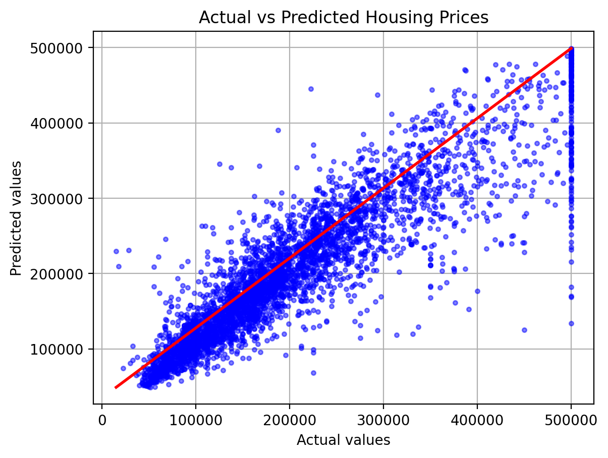
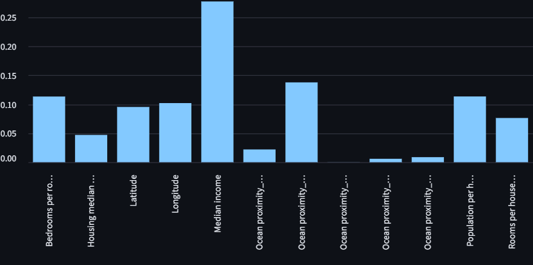

# 🏠 Housing price predictor

A simple machine learning project that predicts housing prices in California using a Random Forest model.

Built with **python**, **numpy**, **pandas**, **scikit-learn**, and **Streamlit** for interactive predictions.

---

### 📌Project Overview

This project includes:

- **Data Preprocessing:** Handles missing values, scales numeric features, encodes categorical data.
- **Model Training:** Random Forest Regressor with hyperparameter tuning.
- **Validation:** Cross-validation to measure model performance (MSE, RMSE, R²).
- **Interactive App:** Streamlit app to visualize predictions, feature importances, and make custom predictions.

---

### ⚡Installation

1. Clone the repository:

```bash
# Clone the repository
git clone https://github.com/MrMatias305/my-first-repo.git
cd my-first-repo
```
2. Install dependencies

```bash
pip install -r requirements.txt
```
---

### 🎯Usage

Run the streamlit app

```bash
pip streamlit run app.py
```
---

### ✨Features
* Visualize actual vs predicted housing prices.
* Analyze data with validation metrics.
* List down feature importances in the order of its priority.
* Make custom predictions interactively.

---

### ✅Validation metrics

 Validation metrics include:
* MSE (Mean Squared Error)
* RMSE (Root Squared Mean Error)
* R² (Coefficient of Determination)

---

### 🚀Model performance

🔰***Actual vs predicted data***



🔰***Feature importances***



---

### 📜License

This project is licensed under the MIT License.

